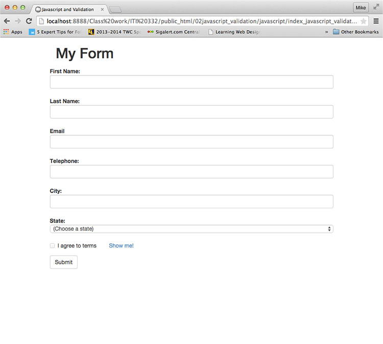
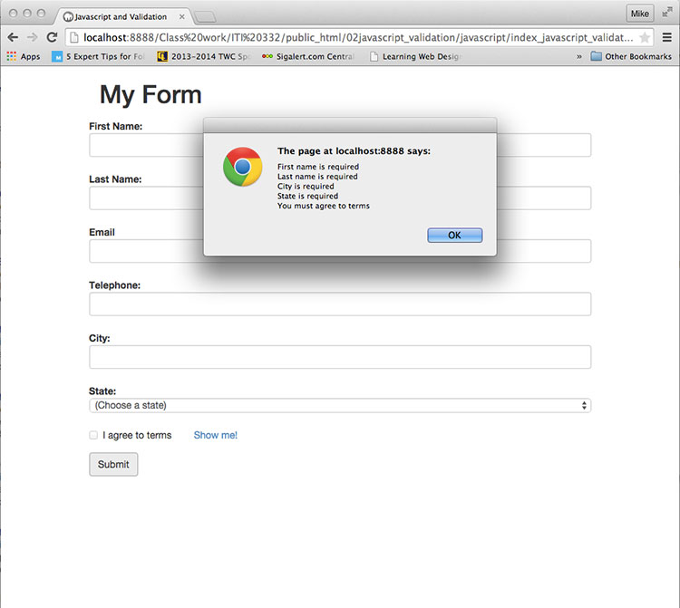
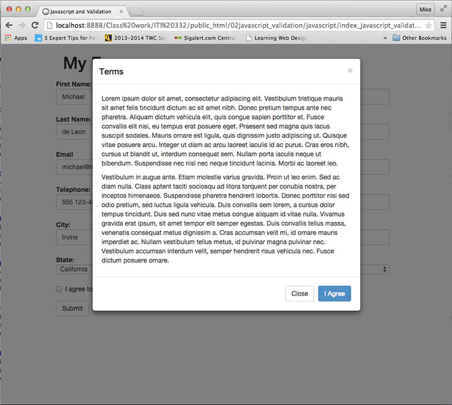

  
`School Work - Advanced Web Design Class - ITI-323`  

# Dates:  
2013 - 2014  
# Technologies:  
HTML5, CSS3, Bootstrap 3, Javascript  
# Description:  
This assignment is showing form validation using Javascript.  The site was created with HTML5, CSS3, Bootstrap 3 and Javascript.  
# Screenshots:
  

  

  
